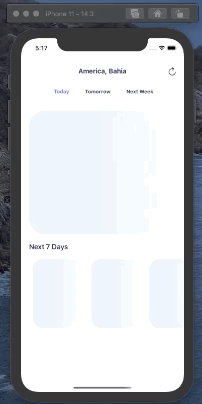

<!--
***
*** Project created by Kaian Cotias
***
-->

## Summary

- [Summary](#summary)
- [About the Project](#about-the-project)
  - [Made with](#made-with)
  - [Architecture](#architecture)
- [How to run](#how-to-run)
- [Contacts](#contacts)

## About the Project


## Made with

The project was built using TypeScript with [React Native](https://reactnative.dev/) 0.63.4.

There are some other dependencies worth mentioning:

- [React Navigation](https://reactnavigation.org/) to handle navigations.
- [React Native Skeleton Content](https://www.npmjs.com/package/react-native-skeleton-content) to provide loading animations
- [React Native Lottie](https://github.com/lottie-react-native/lottie-react-native) To provide animations.
- [RecoilJS](https://recoiljs.org/) As a global state management.

## Architecture

Since it was a fairly small and simple project with only one screen i have chosen to follow a not so granular version of the Atomic Design since any other approach would've been too much fancy.

### Not Granular Atomic

```bash
| --- assets
| --- components
| ------- Header
| ------- Button
| ------- LoginInput
| ------- LoginCard
| ------- CashoutCard
| ------- CashoutInput
| --- screens
| ------- WelcomeScreen
| ------- LoginScreen
| ------- SigninScreen
| ------- CashoutHomeScreen
| ------- PaymentScreen
| --- services
| --- navigation
| --- utils
```

For bigger projects that we have to keep in mind subjects like - scalability, maintenability, bigger teams, and fast onboarding of new Devs - i would use a mix of the well known Atomic Pattern with a modular approach to separate each vertical of the App making each of them independent units with their own components, services and utils, and leaving the default components folder on the root, only for the universal components. Much like what wix uses for their RN app.

### Modular

```bash
| --- assets
| --- components
| ------- Header
| ------- Button
| --- modules
| ------- Onboarding
| ----------- screens
| --------------- WelcomeScreen
| --------------- LoginScreen
| --------------- SignInScreen
| ----------- components
| --------------- LoginInput
| --------------- LoginCard
| --- services
| --- navigation
| --- utils
```

For naming i've adopted the PascalCase style for files and folders.

I've decided to use FC (functional components) all over the app instead of the classic class based components, since this is how the Facebook team claims to be the future of React, and specially because it provides us a cleaner and more performatic codebase. Replacing lifecycle methods with the useEffect Hook, and the regular state definition with the new useState hook.

For styling i didn't used any helper such as Styled Components, only to show my knowledge on css-in-js pattern itself.

A global state management wasn't needed, but since this was a sample project, i've chose to use one just for demonstration purposes, and thats why i've made the WELCOME screen - which is totally unecessary -, but i've wanted to show some state sharing through screens using recoil. Annnnd, why recoil? It's a fact that the community takes redux as the silver bullet of state management, but i don't think it is always the best option, specially for smaller and less complex apps. We have plenty of options that are easier to setup and less complex to work with like mobx, and recoil. Redux is fairly verbous, and if we do not pay attention we can end up bringing hell to our apps through its action calls and immutability. I was about to use mobx, a derivative state management, but i thought it would be fun to go with something new. Recoil is fast, simple, and its made by facebook, probably will be the future for state management in React. (I hope haha)

To improve performance i've made little choices that won't impact an App with this size, but in a bigger App they would've made a great impact:

- Using React.memo() HOC to memoize components and avoid unecessary rerender on some components, providing us the same functionality of PureComponent, i've added below a live example of its impacts on preventing rerendering, now, imagine this on a huge app? Biiiig impact.

  

  WITHOUT MEMO

  

  WITH MEMO

- Followed the 'Jsx no bind' and used useCallback on my callback, this rule which is basically not using inline arrow functions and binding on JSX:

  `Using arrow functions or binding in JSX is a bad practice that hurts performance, because the function is recreated on each render.

  Whenever a function is created, the previous function is garbage collected. Rerendering many elements might create jank in animations.

  Using an inline arrow function will cause PureComponents, and components that use shallowCompare in the shouldComponentUpdate method to rerender anyway. Since the arrow function prop is recreated each time, the shallow compare will identify it as a change to a prop, and the component will rerender.`
  read more at: https://stackoverflow.com/a/36677798

- Added Paths aliases so we can have absolute imports and prevent us from the ../../ hell!

  This -> `import { Button } from 'components'`

  Instead of this -> `import { Button } from '../../../../../../components'`

- Used Skeleton to handle loadings and give users feedback.

  

- Added a pre commit hook to work like a 'CI' and make sure my code was clean when integrating new code.

- And finally, i've made a simple .env config since we have to take care of our Keys and Urls, but i kept them exposed so you guys can test the app haha

## How to run

I've made the App using IOS simulator to be faster since i only had my free time, SO I HIGHLY RECOMMEND THE IPHONE 11 to be the test device. I haven't tested on Android and other device screens because i chose to invest my time on making a more complex app. I would totally give a little more attention to responsiveness and screen sizes using react-native-screens but due to lack of time i thought it wouldn't affect the result, but i'm planning on doing it as the next steps.

PS: REMEMBER TO ALLOW LOCATION SERVICES AND SET A CUSTOM LOCATION ON - SIMULATOR -> FEATURES -> LOCATION. :P

Running locally:

Make sure you have installed:

- Node
- React Native
- yarn (optional)
- Pods

I've commited the .env so you should be able to run it and test with only one line:

### YARN

```bash
yarn run weathery
```

It will install node_modules, pod install and automatically run on an iphone 11.

or if you're old school, you can do:

```bash
yarn
cd ios
pod install
cd ..
yarn run ios
```

### NPM

```bash
npm run weathery
```

It will install node_modules, pod install and automatically run on an iphone 11.

or if you're old school, you can do:

```bash
npm i
cd ios
pod install
cd ..
npm run ios  or npx react-native run-ios
```

About tests ...
Since i'm working on weekday, i made all i could to finish it by doing on my freetime, barely haven't slept haha, so i chose to deliver faster and a more complex app, but, that doesnt mean i dont value tests, by the opposite, chat me about it :). It will surely be my next steps.

## Contacts

You can see a little more of my job at my github profile where i have some open source RN libraries, Please give me a like :P.

phone: +55 11 991803266

linkedin: http://www.linkedin.com/in/kcotias

instagram: @kaiandev

### Thanks a lot for your time :)
